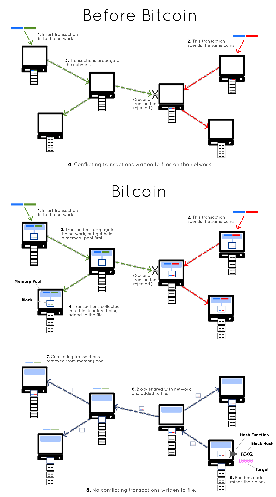

# What is Bitcoin?

Bitcoin is an electronic payment system, but really it’s just a computer program.

When you run the program, it connects to other computers running the same program all over the world. This creates a massive network of computers that can communicate and share information with each other. All of this happens for one reason… to share a file, and this file is called the blockchain.

The blockchain is a file that contains transactions. Anyone can make a transaction and insert it in to a computer on the network. From here, it will be passed from computer to computer until everyone has a copy. Eventually, this transaction makes it in to the blockchain.

However, there’s a problem.

You can actually insert two conflicting transactions in to the network at the same time. For example,  you can buy a pizza in one transaction, then create another transaction and use the same money to buy some beer. If you insert both of these transactions in to different ends of the network at the same time, some computers will get the pizza transaction first, and some computers will get the beer transaction first.

Who should get the money?

Both of these transactions can’t be written to the file, as that would be a “double-spend”. Still, we have a network of computers with conflicting transactions on them, and no single computer is in charge. So how can we decide?

Bitcoin solves this problem through a system called “mining”. Instead of writing all new transactions on to the blockchain (and writing double-spends on to the file), all new transactions get held in a waiting area called the “memory pool”. From here, each computer can collect the transactions from their memory pool in to a “block”, and try to add this block of transactions on to the blockchain. Whoever adds their block on to the blockchain first decides which transaction makes it.

So this is where the competition starts...

Each computer starts by putting their block (every block is different) through what’s called a “hash function”. This hash function takes in a block, and scrambles it to produce a random number from it. Unusual, I know, but this is what hash functions do. Interestingly, nobody knows what number a hash function will spit out based on the data you feed in to it – you just have to try it and find out.

Anyway, the contest here is to try and get a number from this hash function (or to be precise, a “block hash”) that is below a certain threshold number. If you can manage to get a low enough number from your block, you can add it on to the blockchain.

And that’s the competition.

For example, let’s say I have the beer transaction in my memory pool. I will construct a block, put that beer transaction inside it, then put that block through the hash function. If the number that comes out isn’t below the threshold, my attempt has failed. However, I can always make a tiny adjustment to the data inside the block (e.g. add a bit of extra data to the end of the block), and put it through the hash function again.

So “mining” basically involves hashing my block as fast as I can, trying to be the first to get a result below the threshold. If I get lucky, I will be the first computer on the network to do so. If this happens, I can send this block to all the other computers on the network, and they will add it on to their blockchain. Then, because this block contains the beer transaction, the conflicting pizza transaction gets kicked out of memory.

So by pure luck and randomness, the beer transaction is the one that makes it in to the blockchain.

The beer transaction may have entered the network slightly after the pizza transaction, but it doesn’t matter. It just so happened that a computer with the beer transaction in its memory was able to build a block and get a low enough hash for it before anyone else, so all nodes accept this block and add it to their file. Any conflicting transactions that are in memory get thrown away.

Upon receiving this new successful block, nodes will drop the current block they were working on and go back in to their memory pool to create a new one. This means that the blockchain is constantly being built, with new blocks of transactions being added on to the chain roughly every 10 minutes.

As a result, we have a system where anyone can insert transactions in to a network of computers, and these computers will all work hard to try and add them on to a shared file.

Thanks to this system of “mining” (preventing any double-spends from being written to the file), we have created an electronic payment system that runs over a network of computers, and it all runs without a cental point of control.

That’s Bitcoin.

